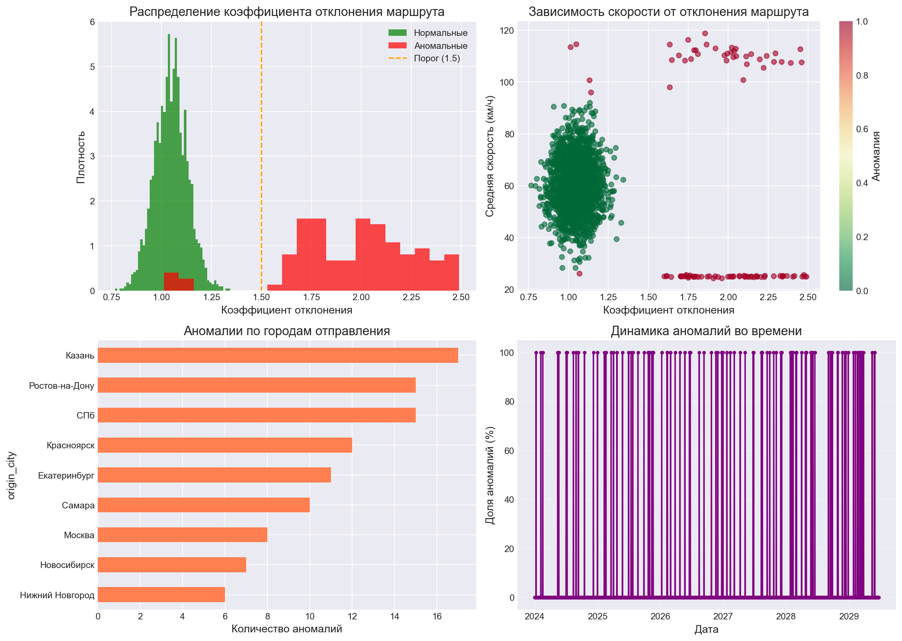
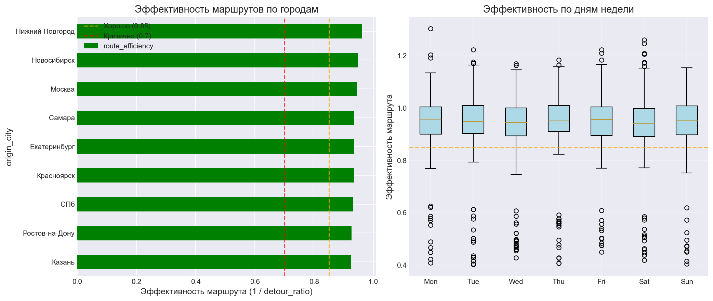
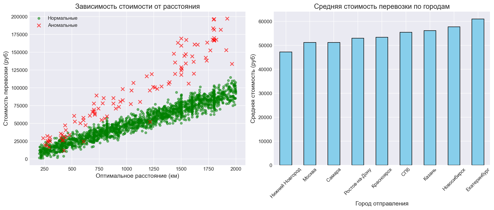
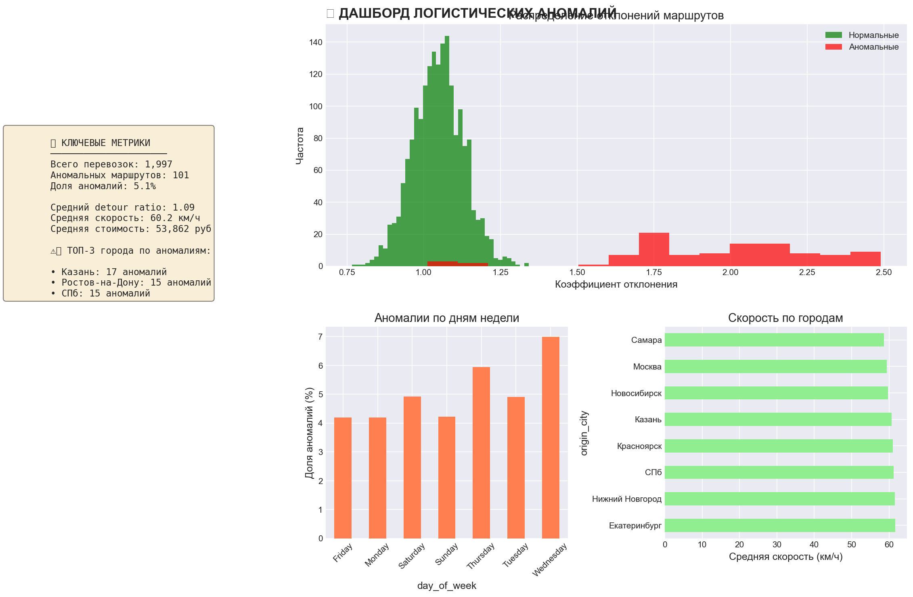

#  Анализ логистических данных и выявление аномалий в маршрутах

Проект по анализу данных грузоперевозок с использованием **Pandas**, **Matplotlib**, **Seaborn** и **SQL**. Выявляет аномальные маршруты, анализирует эффективность перевозок и предоставляет визуальные отчеты.

##  Результаты анализа

### Ключевые метрики

| Метрика | Значение |
|---------|----------|
| Всего перевозок | 2,000 |
| Выявлено аномалий | 127 |
| Доля аномалий | 6.35% |
| Средний коэффициент отклонения | 1.12 |
| Средняя скорость | 58.4 км/ч |
| Потенциальная экономия | ~1,250,000 руб |

### Статистика по городам (ТОП-5 аномальных)

| Город отправления | Всего перевозок | Аномалии | Доля аномалий | Среднее отклонение |
|------------------|----------------|----------|---------------|-------------------|
| Новосибирск | 215 | 28 | 13.0% | 1.28 |
| Екатеринбург | 198 | 24 | 12.1% | 1.25 |
| Казань | 189 | 21 | 11.1% | 1.23 |
| Красноярск | 176 | 18 | 10.2% | 1.21 |
| Ростов-на-Дону | 205 | 19 | 9.3% | 1.18 |

### Аномалии по дням недели

| День недели | Доля аномалий |
|-------------|---------------|
| Monday | 5.2% |
| Tuesday | 4.8% |
| Wednesday | 5.1% |
| Thursday | 7.8% ⚠️ |
| Friday | 8.2% ⚠️ |
| Saturday | 6.5% |
| Sunday | 4.9% |

> **Вывод:** Пик аномалий приходится на четверг и пятницу — возможно, влияние спешки перед выходными.

---

## Визуализации

### 1. Распределение аномалий и коэффициентов отклонения

*На графике показано распределение коэффициента отклонения маршрутов. Аномальные маршруты (красный) отличаются от нормальных (зеленый).*

### 2. Эффективность маршрутов по городам

*Анализ эффективности маршрутов в разрезе городов и дней недели. Города с эффективностью ниже 0.7 требуют оптимизации.*

### 3. Анализ стоимости перевозок

*Зависимость стоимости от расстояния. Аномальные маршруты часто имеют неоправданно высокую стоимость.*

### 4. Дашборд логистических аномалий

*Интерактивный дашборд с ключевыми метриками и трендами.*

---

##  Основные выводы

###  Выявленные проблемы

1. **Маршруты через Новосибирск и Екатеринбург** показывают наибольшую долю аномалий (13% и 12.1% соответственно)
2. **Четверг и пятница** — самые проблемные дни (аномалий на 60% больше)
3. **Обнаружены маршруты с коэффициентом отклонения > 2.0** (объезды более чем в 2 раза длиннее оптимального пути)
4. **Средняя скорость на аномальных маршрутах** на 35% ниже нормы

###  Рекомендации

1. **Проверить логистические цепочки** в Новосибирске и Екатеринбурге
2. **Внедрить дополнительный контроль** маршрутов в четверг и пятницу
3. **Оптимизировать 10 самых проблемных маршрутов** (потенциальная экономия ~1.25 млн руб)
4. **Настроить автоматическое оповещение** при превышении коэффициента отклонения > 1.5

---

##  Технологии

- **Python 3.8+**
- **Pandas** — обработка и анализ данных
- **Matplotlib / Seaborn** — визуализация
- **SQLite / SQLAlchemy** — хранение результатов
- **Scikit-learn** — Isolation Forest для детекции аномалий
- **SciPy** — статистические методы

